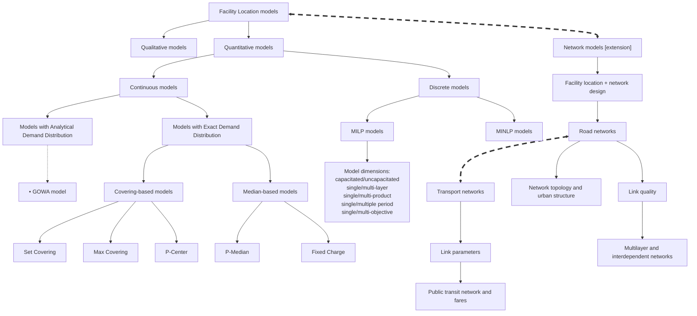

# Таймлайн: facility location + transportation network design

Основано на статье:

Melkote, S., & Daskin, M. S. (2001). An integrated model of facility location and transportation network design. *Transportation Research Part A: Policy and Practice*, 35(6), 515-538. https://doi.org/10.1016/S0965-8564(00)00005-7

Источник в локальном Zotero:

- Zotero item: `NN4ASPN7`
- PDF attachment: `/Users/gk/Zotero/storage/IC6GWNET/Melkote and Daskin - 2001 - An integrated model of facility location and transportation network design.pdf`

## Схема

| Период | Этап исследовательского развития | Ссылки |
| --- | --- | --- |
| 1960-е | Базовые дискретные модели размещения: warehouse / simple plant location, p-median, p-center | [1], [2] |
| 1970-е | Покрывающие модели размещения общественных сервисов: set covering и maximal covering | [3], [4] |
| 1980-е | Развитие моделей проектирования транспортных сетей и fixed-charge network design | [5], [6], [7] |
| 1980-е - 1990-е | Учет маршрутизации и времени движения в задачах размещения: emergency services, location-routing, traveling-salesman location | [8], [9], [10], [11] |
| 1990-е | Переход от "сеть как данность" к анализу влияния структуры сети на результат размещения | [12], [13], [14], [15] |
| 1990-е | Hub location как частный случай совместного решения "где разместить узлы" и "как соединить сеть" | [16], [17] |
| 1993-2000 | Прямое формирование класса integrated / combined facility location-network design | [18], [19], [20], [21] |
| 2001 | Интегрированная модель UFLNDP: одновременный выбор объектов обслуживания и проектирование транспортной сети | [22] |
| 2022 | Healthcare FLNDP: стоимость, доступность, справедливость; ребра сети заданы как типизированные links с параметрами качества, скорости, стоимости и емкости | [23] |
| 2022 | Многослойное представление городской мобильности: разные виды транспорта рассматриваются как связанные слои одной сети | [29] |
| 2024 | Non-motorized FLND: совместный выбор новых сервисов и доступных сегментов сети с учетом разных пеших возможностей пользователей | [24] |
| 2024 | Compact plus network: одновременная оптимизация размещения публичных объектов, сети общественного транспорта и тарифов | [25] |
| 2025 | Явное изучение топологии дорожной сети как фактора, меняющего результаты location-allocation моделей | [26] |
| 2026 | Accessibility / x-minuteness: переход от среднего значения по городу к различиям между морфологическими типами городской ткани | [27] |

## Рабочий список источников

[1] Kuehn, A. A., & Hamburger, M. J. (1963). A heuristic program for locating warehouses. *Management Science*, 9, 643-666.

[2] Hakimi, S. L. (1964). Optimum locations of switching centers and the absolute centers and medians of a graph. *Operations Research*, 12, 450-459.

[3] Toregas, C., Swain, R., ReVelle, C., & Bergmann, L. (1971). The location of emergency service facilities. *Operations Research*, 19, 1363-1373.

[4] Church, R., & ReVelle, C. (1974). The maximal covering location problem. *Regional Science Association Papers*, 32, 101-118.

[5] Magnanti, T. L., & Wong, R. T. (1984). Network design and transportation planning: models and algorithms. *Transportation Science*, 18, 1-55.

[6] Powell, W. B., & Sheffi, Y. (1989). Design and implementation of an interactive optimization system for network design in the motor carrier industry. *Operations Research*, 37, 12-29.

[7] Balakrishnan, A., Magnanti, T. L., & Wong, R. T. (1989). A dual-ascent procedure for large-scale uncapacitated network design. *Operations Research*, 37, 716-740.

[8] Daskin, M. S. (1987). Location, dispatching, and routing models for emergency services with stochastic travel times. In A. Ghosh & G. Rushton (Eds.), *Spatial Analysis and Location-Allocation Models* (pp. 224-265). Van Nostrand Reinhold.

[9] Simchi-Levi, D., & Berman, O. (1988). A heuristic algorithm for the travelling salesman location problem on networks. *Operations Research*, 36, 478-484.

[10] Laporte, G. (1988). Location-routing problems. In B. Golden & A. Assad (Eds.), *Vehicle Routing: Methods and Studies* (pp. 163-198). North-Holland.

[11] Min, H., Jayaraman, V., & Srivastava, R. (1998). Combined location-routing problems: A synthesis and future research directions. *European Journal of Operational Research*, 108, 1-15.

[12] Berman, O., Ingco, D. I., & Odoni, A. R. (1992). Improving the location of minisum facilities through network modification. *Annals of Operations Research*, 40, 1-16.

[13] Hodgson, M. J., & Rosing, K. E. (1992). A network location-allocation model trading off flow capturing and p-median objectives. *Annals of Operations Research*, 40, 247-260.

[14] Peeters, D., & Thomas, I. (1995). The effect of spatial structure on p-median results. *Transportation Science*, 29, 366-373.

[15] ReVelle, C. S., & Laporte, G. (1996). The plant location problem: New models and research prospects. *Operations Research*, 44, 864-874.

[16] Campbell, J. F. (1994). A survey of network hub location. *Studies in Locational Analysis*, 6, 31-49.

[17] Klincewicz, J. G. (1998). Hub location in backbone/tributary network design: A review. *Location Science*, forthcoming.

[18] Daskin, M. S., Hurter, A. P., & VanBuer, M. G. (1993). *Toward an integrated model of facility location and transportation network design*. Working Paper, The Transportation Center, Northwestern University.

[19] Melkote, S. (1996). *Integrated models of facility location and network design*. PhD Dissertation, Department of Industrial Engineering and Management Sciences, Northwestern University.

[20] Melkote, S., & Daskin, M. S. (1998). The maximum covering facility location-network design problem. *Location Science*, under review.

[21] Melkote, S., & Daskin, M. S. (2000). Capacitated facility location-network design problems. *European Journal of Operational Research*, forthcoming.

[22] Melkote, S., & Daskin, M. S. (2001). An integrated model of facility location and transportation network design. *Transportation Research Part A: Policy and Practice*, 35(6), 515-538.

[23] Pourrezaie-Khaligh, P., Bozorgi-Amiri, A., Yousefi-Babadi, A., & Moon, I. (2022). Fix-and-optimize approach for a healthcare facility location/network design problem considering equity and accessibility: A case study. *Applied Mathematical Modelling*, 102, 243-267.

[24] Starita, S., Tea-Makorn, P., & Jindahra, P. (2024). Building non-motorized accessible communities for heterogeneous demand: A facility location and network design problem. *PLOS ONE*, 19(10), e0312230. https://doi.org/10.1371/journal.pone.0312230

[25] Sugama, A., & Okumura, M. (2024). Simultaneous design model of public facility location, transit network, and fare system applied to spillover analysis of facility management efficiency. *Journal of the City Planning Institute of Japan*, 59(1).

[26] Zhou, B. (2025). The impact of road networks on facility location modeling: An interpretation from a network topological perspective. *Journal of Geographic Information System*, 17(4), 167-198. https://doi.org/10.4236/jgis.2025.174009

[27] Droin, A., Wurm, M., Weigand, M., Debray, H., Koberl, M., & Taubenbock, H. (2026). The influence of urban structure types on the x-minuteness of cities: An accessibility analysis of 15 German cities. *Environment and Planning B: Urban Analytics and City Science*. https://doi.org/10.1177/23998083261424942

[28] Dybskaya, V. V., & Sverchkov, P. A. (2017). Designing a rational distribution network for trading companies. *Transport and Telecommunication Journal*, 18(3), 181-193. https://doi.org/10.1515/ttj-2017-0016

[29] Alessandretti, L., Natera Orozco, L. G., Saberi, M., Szell, M., & Battiston, F. (2022). Multimodal urban mobility and multilayer transport networks. *Environment and Planning B: Urban Analytics and City Science*, 50(8), 2038-2070.

[30] Gallotti, R., & Barthelemy, M. (2014). Anatomy and efficiency of urban multimodal mobility. *Scientific Reports*, 4, 6911.

[31] Aleta, A., Teixeira, A. S., de Arruda, G. F., Baronchelli, A., Barrat, A., Kertesz, J., Diaz-Guilera, A., Artime, O., Starnini, M., Petri, G., Karsai, M., Patwardhan, S., Coronges, K., McCranie, A., Vespignani, A., Moreno, Y., & Fortunato, S. (2026). Multilayer network science: theory, methods, and applications. *Journal of Complex Networks*, 14(2), cnag007. https://doi.org/10.1093/comnet/cnag007

---

## Схема классификации facility location + network design models

Базовая форма взята из Figure 1 у Dybskaya & Sverchkov (2017): классификация facility location models [28]. Сохраняем исходную логику схемы, но раскрываем узел `Network models`, потому что именно он связывает классические FLP с рассмотренными работами по FLND/TNDP.

### Расширенная секция: network / network design

В исходной классификации `Network models` - одна из ветвей количественных моделей размещения. Рассмотренные статьи позволяют раскрыть эту ветвь: сеть не только задает расстояния между спросом и объектами, но сама становится объектом проектного решения.

| Год | Сетевой аспект | Как расширяется схема | Источники |
| --- | --- | --- | --- |
| 2001 | Сеть не только среда расчета расстояний | Конфигурация сети влияет на оптимальное размещение объектов; поэтому при проектировании надо рассматривать не только объекты, но и изменения связей. | [22] |
| 2001, 2022 | Одновременный выбор объектов и связей | Проектный вариант должен включать решения по facility location и network design одновременно: открыть объекты, построить/улучшить связи, оценить общий эффект. | [22], [23] |
| 2024 | Доступность сети для разных групп | В pedestrian/non-motorized задачах улучшение сети может означать не новую дорогу, а превращение сегмента в доступный для конкретной группы пользователей. | [24] |
| 2024 | Общественный транспорт как часть сети | В compact-plus-network постановке проектируется не только расположение объектов, но и public transit network; тарифы становятся механизмом управления спросом в этой сети. | [25] |
| 2022 | Параметры и качество ребер | В healthcare FLNDP ребра заданы как transfer links разных типов; в кейсе используются `freeway`, `highway`, `paved road`, различающиеся стоимостью, operating cost, travel cost, average speed и capacity. В обзоре также вскользь отмечены `parameter uncertainty` и `system disruption` как близкая постановка robust/reliable FLNDP. | [23] |
| 2022, 2026 | Многоуровневость и созависимость слоев | Транспортная сеть может рассматриваться как multilayer system, где виды транспорта образуют связанные слои; несогласованность между слоями multimodal mobility может снижать эффективность и доступность перемещений. | [29], [30], [31] |
| 2025 | Топология сети | Перед оптимизацией нужно оценивать connectivity, centrality и тип структуры сети, потому что grid/ring/radial структуры дают разные location-allocation результаты. | [26] |
| 2026 | Сеть и городская ткань | Эффект сетевых улучшений зависит от urban structure types: районы с разной морфологией имеют разные профили pedestrian x-minuteness. | [27] |

### Связь расширения network design с работами из Zotero MINE

| Часть работы | Узел схемы | Как используется |
| --- | --- | --- |
| 1.1 | `Road networks` -> `Link quality` | Внешняя среда меняет состояние сети: ребра могут появляться/исчезать, а service catchments перераспределяются. |
| 1.2 | `Road networks` -> `Link quality` | Climate stressors переводятся в изменение параметров/доступности дорожных ребер; это основа для equatorial supply-chain экспериментов. |
| 2.1 | `Transport networks` | Размещение сервисов рассматривается вместе с изменяемой транспортной доступностью: можно сравнивать новые сервисы, улучшение связей и изменение спроса. |
| 2.2 | `Transport networks` -> `Public transit network and fares` | TNDP расширяет транспортную ветку: сеть ОТ можно проектировать с учетом connectivity/accessibility objective. |
| support 2.1 | `Transport networks` | Spatial-morphological imputation используется как механизм роста demand при изменении land use; SPB-эксперимент сравнивает этот рост с эффектом добавления дороги. |
