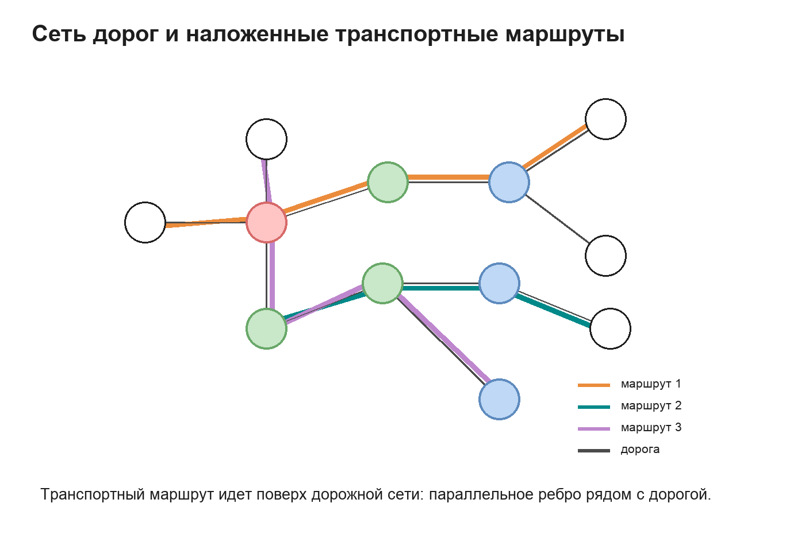
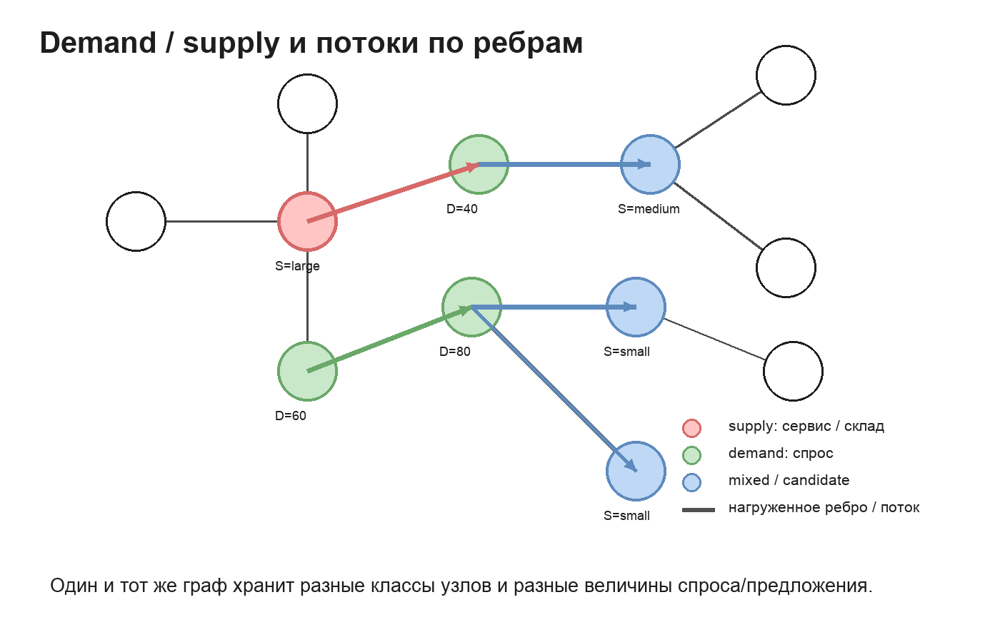
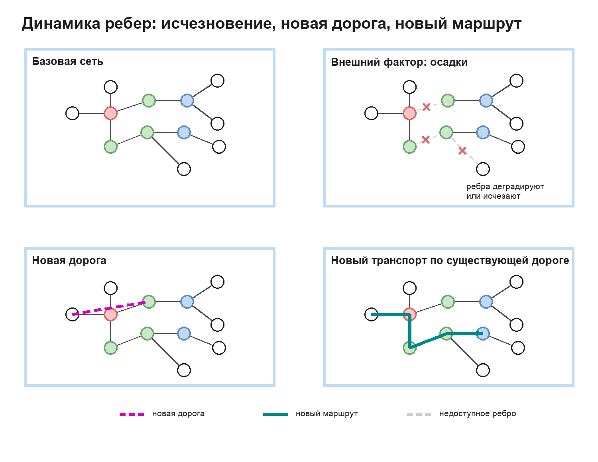

# Схемы представления сети

Эти схемы описывают рабочую постановку графа: узлы разных классов, дорожные ребра, транспортные маршруты как дополнительные связи поверх дорог, а также динамику ребер под внешними факторами.

---

## Математическое описание сети

Сеть задается как многослойный граф:

$$
\mathcal{G}_t = (V, E^r_t, E^\tau_t),
$$

где $V$ — множество пространственных узлов, $E^r_t$ — дорожные ребра, а $E^\tau_t$ — транспортные связи, наложенные поверх дорожной сети. Узел может одновременно иметь несколько ролей: быть источником спроса, существующим сервисом, кандидатом для размещения нового сервиса или транзитной точкой. Поэтому роли удобнее задавать параметрами:

$$
d_i^k(t) \ge 0,\qquad q_i^k(t) \ge 0,\qquad i \in V,
$$

где $d_i^k(t)$ — спрос типа $k$ в узле $i$, а $q_i^k(t)$ — доступная мощность или предложение сервиса типа $k$ в этом узле.

Дорожное ребро $e=(i,j)\in E^r_t$ имеет длину, стоимость/время перемещения и состояние доступности:

$$
e = (i,j,l_e,c_e(t),a_e(t),\rho_e),\qquad a_e(t)\in\{0,1\}.
$$

Здесь $l_e$ — длина, $c_e(t)$ — обобщенная стоимость или время движения, $a_e(t)$ показывает, доступно ли ребро, а $\rho_e$ описывает тип или качество дороги. Внешнее состояние среды $z_t$ меняет параметры ребра:

$$
c_e(t)=C_e(\rho_e,z_t),\qquad a_e(t)=A_e(\rho_e,z_t).
$$

То есть осадки, сезонность или другой стрессор могут не менять топологию узлов, но менять стоимость движения по ребрам или временно исключать часть ребер из сети.

Транспортный маршрут $r\in R_t$ задается последовательностью узлов:

$$
r=(v_1,\ldots,v_m),\qquad (v_p,v_{p+1}) \text{ соединены дорожным путем в } E^r_t.
$$

Маршрут порождает дополнительные транспортные связи $E^\tau_t(r)$: они не заменяют дорогу, а добавляют поверх нее отдельный слой доступности с собственными параметрами времени, частоты, тарифа или режима движения.

Поток спроса от узлов спроса к узлам предложения можно записать как $x_{ij}^k(t)$, а нагрузку на ребро — как $f_e^k(t)$. Доступность сервиса определяется кратчайшим или минимально-стоимостным путем по активной сети:

$$
T_{ij}^k(t)=\operatorname{dist}_{\mathcal{G}_t}(i,j),
$$

где путь может использовать только дорожные ребра или комбинацию дорожного и транспортного слоя. В таком виде одна и та же постановка описывает три операции на схемах ниже: добавление маршрута, перераспределение потоков между demand/supply-узлами и изменение сети из-за исчезновения или появления ребер.

---

## Краткая версия для слайда

$$
\mathcal{G}_t=(V,E^r_t,E^\tau_t)
$$

$$
\begin{aligned}
V &= \text{множество узлов сети},\\
V^D &\subseteq V,\quad \text{узлы спроса},\\
V^S &\subseteq V,\quad \text{узлы предложения / сервисов},\\
E^r_t &= \text{дорожные ребра},\\
E^\tau_t &= \text{транспортные связи поверх дорог},\\
d_i^k(t) &= \text{спрос типа } k \text{ в узле } i,\\
q_i^k(t) &= \text{мощность сервиса типа } k \text{ в узле } i,\\
a_e(t) &\in \{0,1\},\quad \text{доступность ребра } e,\\
c_e(t) &= \text{время / стоимость движения по ребру } e,\\
\rho_e &= \text{тип / качество дорожного ребра } e,\\
z_t &= \text{внешнее состояние среды в момент } t,\\
C_e(\rho_e,z_t) &= \text{функция стоимости ребра},\\
A_e(\rho_e,z_t) &= \text{функция доступности ребра},\\
T_{ij}^k(t) &= \text{время / стоимость пути от } i \text{ к } j,\\
S_k &= \text{допустимое время / расстояние для сервиса типа } k,\\
N_i^k(t) &= \text{достижимые сервисы для узла спроса } i,\\
E^{new}_t &= \text{новые дорожные ребра},\\
E^{lost}_t &= \text{недоступные дорожные ребра},\\
E^{route}_t &= \text{новые транспортные связи}.
\end{aligned}
$$

$$
c_e(t)=C_e(\rho_e,z_t),\qquad a_e(t)=A_e(\rho_e,z_t)
$$

$$
T_{ij}^k(t)=\operatorname{dist}_{\mathcal{G}_t}(i,j)
$$

$$
N_i^k(t)=\{j\in V^S\mid T_{ij}^k(t)\le S_k,\ q_j^k(t)>0\}
$$

$$
\begin{aligned}
E^r_{t+1} &= E^r_t \cup E^{new}_t \setminus E^{lost}_t,\\
E^\tau_{t+1} &= E^\tau_t \cup E^{route}_t.
\end{aligned}
$$

---

## Дорожная сеть и транспортные маршруты

---

## Demand / supply и потоки

---

## Динамика ребер

